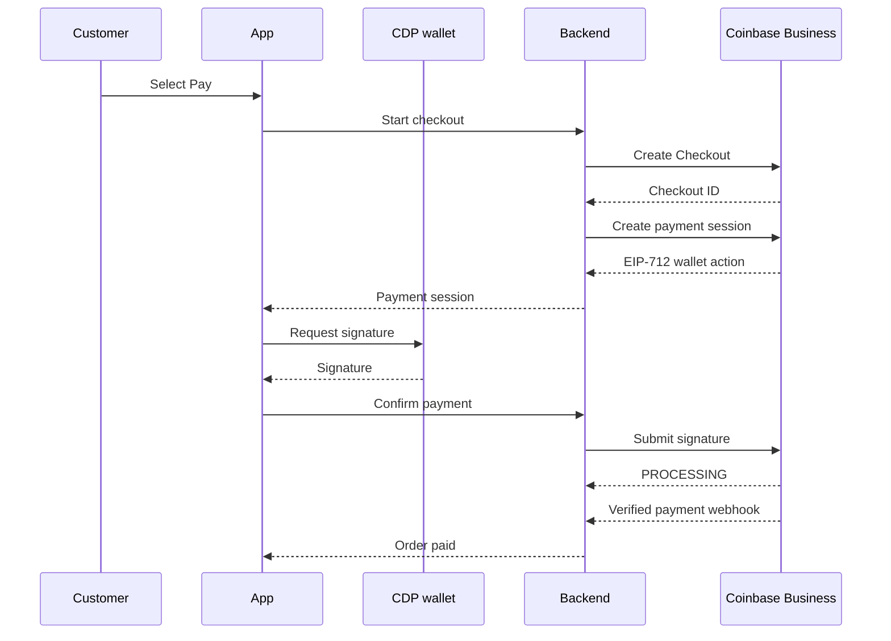

<!--
INTERNAL EDITORIAL NOTE

This is public-facing draft copy for a future Checkout Payment Sessions API.
The endpoint names and response schemas below are proposed public contracts:

  POST /api/v1/checkouts/{checkoutId}/payment-sessions
  POST /api/v1/checkouts/{checkoutId}/payment-sessions/{paymentSessionId}/confirm

Do not publish this guide until equivalent authenticated, versioned public
endpoints are available. Do not replace them with the current
payments.coinbase.com/next-api implementation used by the CoinBiz prototype.
-->

# Accept Checkout payments with CDP Embedded Wallets

Use CDP Embedded Wallets to let customers complete Coinbase Business Checkouts without leaving your product. Your backend creates and tracks the Checkout, while the customer's CDP wallet signs the payment authorization from your web or mobile app.

Together, Coinbase Business and CDP give you a native payment experience across platforms:

- **Web:** The customer signs in and approves payment without leaving your website.
- **Mobile:** The same wallet flow works inside an iOS or Android application.
- **No hosted redirect:** Your product owns the payment interface while Coinbase Business manages the Checkout lifecycle.

CDP Embedded Wallets are the recommended implementation in this guide. Because the Checkout authorization uses the EIP-712 standard, you can also integrate another compatible wallet provider.

## What you'll build

In this guide, you will:

1. Create a single-use Checkout from your backend.
2. Request a wallet-signable payment session for the Checkout.
3. Display the payment details and ask the customer to approve them.
4. Sign the payment authorization with a CDP wallet.
5. Confirm the payment session from your backend.
6. Fulfill the order after receiving a verified Checkout webhook.

The customer stays inside your application throughout the flow. Coinbase Business remains the system of record for payment status, settlement, reporting, and refunds.



## Prerequisites

You need:

- A [Coinbase Business account](https://www.coinbase.com/business)
- A CDP API key with access to the Checkout APIs
- A CDP project configured for Embedded Wallets
- A backend that can keep your CDP API key secret
- A CDP EVM EOA for the payer
- A public HTTPS endpoint for [Checkout webhooks](https://docs.cdp.coinbase.com/coinbase-business/checkout-apis/webhooks)

Complete the [CDP User Wallet quickstart](https://docs.cdp.coinbase.com/wallets/quickstart/user-auth) and [Coinbase Business API key authentication](https://docs.cdp.coinbase.com/coinbase-business/authentication-authorization/api-key-authentication) before continuing. For iOS and Android, use the [CDP React Native quickstart](https://docs.cdp.coinbase.com/wallets/client-side-development/react-native).

## Web and mobile support

CDP uses the same React wallet hooks across web and React Native, so the Checkout orchestration and signing code can remain consistent across platforms.

| Platform | Customer experience | CDP capability |
|---|---|---|
| Web | The customer signs in and approves the payment in your website | CDP React SDK and `useSignEvmTypedData` |
| Mobile | The customer signs in and approves the payment in your iOS or Android app | CDP React Native SDK using the same React hooks |

Request the signature only after the customer has reviewed the payment amount, asset, network, business, and connected wallet.

This guide uses an EVM externally owned account (EOA). Smart contract accounts require Checkout to support the account's signature-verification standard, such as EIP-1271 or ERC-6492.

### Using another wallet provider

Checkout payment sessions are compatible with another wallet provider when the wallet can return an EVM EOA address, sign the Coinbase-issued EIP-712 payload without modification, and return a `0x`-prefixed signature. Privy, Dynamic, and Turnkey expose compatible EIP-712 signing interfaces. See [Using another embedded-wallet provider](#using-another-embedded-wallet-provider) for examples.

## 1. Create a Checkout

Create a new Checkout from your backend for every purchase. Never call the Coinbase Business API directly from the browser or expose your CDP credentials to the customer.

```ts
const checkoutPath = "/api/v1/checkouts";

const response = await fetch(`https://business.coinbase.com${checkoutPath}`, {
  method: "POST",
  headers: {
    Authorization: `Bearer ${await createCoinbaseBusinessJwt(
      "POST",
      checkoutPath,
    )}`,
    "Content-Type": "application/json",
    "X-Idempotency-Key": crypto.randomUUID(),
  },
  body: JSON.stringify({
    amount: "25.00",
    currency: "USDC",
    description: "Order #12345",
    metadata: {
      orderId: "12345",
      customerId: "cust_abc123",
    },
  }),
});

if (!response.ok) {
  throw new Error(`Checkout creation failed: ${response.status}`);
}

const checkout = await response.json();
```

Persist `checkout.id` with your order. Although the response also includes a hosted Checkout URL, you do not need to navigate to that URL for this integration.

See [Create Checkout](https://docs.cdp.coinbase.com/api-reference/business-api/rest-api/checkouts/create-checkout) for the complete request and response schema.

## 2. Create a payment session

After the customer has authenticated their wallet, send its public address to your backend. Your backend then creates a payment session for the Checkout.

```ts
const paymentSessionPath =
  `/api/v1/checkouts/${checkout.id}/payment-sessions`;

const response = await fetch(
  `https://business.coinbase.com${paymentSessionPath}`,
  {
    method: "POST",
    headers: {
      Authorization: `Bearer ${await createCoinbaseBusinessJwt(
        "POST",
        paymentSessionPath,
      )}`,
      "Content-Type": "application/json",
      "X-Idempotency-Key": crypto.randomUUID(),
    },
    body: JSON.stringify({
      payerAddress: customerWalletAddress,
    }),
  },
);

if (!response.ok) {
  throw new Error(`Payment session creation failed: ${response.status}`);
}

const paymentSession = await response.json();
```

The response contains a wallet action that can be passed to an EIP-712-compatible signer:

```json
{
  "id": "cps_01k...",
  "checkoutId": "68f7a946db0529ea9b6d3a12",
  "status": "REQUIRES_SIGNATURE",
  "expiresAt": "2026-07-21T23:30:00Z",
  "walletAction": {
    "method": "eth_signTypedData_v4",
    "chainId": 8453,
    "typedData": {
      "domain": {},
      "types": {},
      "primaryType": "ReceiveWithAuthorization",
      "message": {}
    }
  }
}
```

Treat the returned wallet action as immutable. Do not construct the authorization in the browser, substitute a contract address, or modify the amount, recipient, nonce, or expiration.

## 3. Show the payment summary

Before requesting a signature, show the customer at least:

- The payment amount and asset
- The network
- Your business or order description
- The connected wallet address
- The authorization expiration

Use an explicit button such as **Pay 25.00 USDC**. Do not initiate a signature request automatically when the page loads.

## 4. Sign with CDP Embedded Wallets

Use the CDP React hooks to obtain the customer's wallet address and request the signature. These hooks are available in both web and React Native applications.

### Web and React Native

```tsx
import {
  useEvmAddress,
  useSignEvmTypedData,
} from "@coinbase/cdp-hooks";

function PayButton({ paymentSession }) {
  const { evmAddress } = useEvmAddress();
  const { signEvmTypedData } = useSignEvmTypedData();

  const pay = async () => {
    if (!evmAddress) throw new Error("Connect a wallet first");

    const result = await signEvmTypedData({
      evmAccount: evmAddress,
      typedData: paymentSession.walletAction.typedData,
    });

    await confirmPayment({
      checkoutId: paymentSession.checkoutId,
      paymentSessionId: paymentSession.id,
      payerAddress: evmAddress,
      signature: result.signature,
    });
  };

  return <button onClick={pay}>Pay 25.00 USDC</button>;
}
```

### Using another embedded-wallet provider

If your product already uses another wallet provider, pass the same Coinbase-issued typed data to its EIP-712 signing method. The rest of the Checkout flow remains unchanged.

#### Privy

```ts
const signature = await signTypedData(
  paymentSession.walletAction.typedData,
  { address: embeddedWallet.address },
);
```

#### Dynamic

```ts
const walletClient = await primaryWallet.getWalletClient();
const signature = await walletClient.signTypedData(
  paymentSession.walletAction.typedData,
);
```

#### Turnkey

When using Turnkey's Viem integration, sign the same object returned by Coinbase:

```ts
const signature = await turnkeyWalletClient.signTypedData(
  paymentSession.walletAction.typedData,
);
```

Regardless of provider, verify that the address sent during payment-session creation is the same address that produced the signature.

## 5. Confirm the payment session

Send the signature to your backend. Your backend submits it to Coinbase using the payment session ID.

```ts
const confirmPath =
  `/api/v1/checkouts/${checkoutId}` +
  `/payment-sessions/${paymentSessionId}/confirm`;

const response = await fetch(`https://business.coinbase.com${confirmPath}`, {
  method: "POST",
  headers: {
    Authorization: `Bearer ${await createCoinbaseBusinessJwt(
      "POST",
      confirmPath,
    )}`,
    "Content-Type": "application/json",
    "X-Idempotency-Key": crypto.randomUUID(),
  },
  body: JSON.stringify({
    payerAddress,
    signature,
  }),
});

if (!response.ok) {
  throw new Error(`Payment confirmation failed: ${response.status}`);
}

const result = await response.json();
```

A successful confirmation means Coinbase accepted the signed authorization. It does not necessarily mean the Checkout has reached its final state. Render a processing state until Coinbase reports `COMPLETED` or another terminal status.

## 6. Confirm payment with webhooks

Use Checkout webhooks as the authoritative signal for order fulfillment. Subscribe to all Checkout event types and verify every webhook signature before updating an order.

For a successful payment:

1. Verify the `X-Hook0-Signature` header against the raw request body.
2. Match the webhook's Checkout ID to the Checkout stored with your order.
3. Confirm `eventType` is `checkout.payment.success` and `status` is `COMPLETED`.
4. Confirm the amount, currency, and metadata match your order.
5. Mark the order paid idempotently.

If webhook delivery is delayed, retrieve the Checkout with `GET /api/v1/checkouts/{id}`. Never fulfill an order based only on a browser redirect, a wallet signature, or a successful payment-session submission.

## Provider-neutral wallet adapter

If your application supports multiple embedded-wallet providers, isolate their SDKs behind a small adapter:

```ts
type Hex = `0x${string}`;

type EmbeddedCheckoutWallet = {
  getAddress(): Promise<Hex>;
  signTypedData(typedData: unknown): Promise<Hex>;
};

async function signCheckout(
  wallet: EmbeddedCheckoutWallet,
  paymentSession: PaymentSession,
) {
  const payerAddress = await wallet.getAddress();
  const signature = await wallet.signTypedData(
    paymentSession.walletAction.typedData,
  );

  return {
    payerAddress,
    paymentSessionId: paymentSession.id,
    signature,
  };
}
```

This keeps Checkout creation, confirmation, reconciliation, and fulfillment independent of the wallet vendor.

## Security requirements

- Keep CDP API keys and JWT generation on your backend.
- Create payment sessions only for authenticated customers and valid orders.
- Bind each payment session to one Checkout, payer address, amount, and expiration.
- Return only Coinbase-issued wallet actions to the browser.
- Never accept a token contract, recipient, collector, callback URL, or arbitrary typed-data payload from the browser.
- Rate-limit Checkout creation and payment confirmation.
- Use idempotency keys for create and confirm operations.
- Do not log raw signatures, authentication tokens, OTPs, or wallet secrets.
- Show the customer what they are authorizing before opening the wallet prompt.
- Treat verified Checkout webhooks—not client state—as the fulfillment authority.

## Common errors

### The signature is invalid

Confirm that:

- The signing address matches the payment session's `payerAddress`.
- The wallet signed the typed data exactly as Coinbase returned it.
- The payment session has not expired.
- Your SDK did not stringify or coerce numeric fields differently before signing.

### The Checkout remains processing

Payment confirmation and final Checkout completion are asynchronous. Continue listening for webhooks and use the Get Checkout endpoint as a recovery path.

### The wallet cannot sign the request

Confirm the wallet is an EVM account with EIP-712 support. If it is a smart contract account, verify that Checkout supports its signature scheme before offering it as a payment option.

## Next steps

- [Checkout APIs overview](https://docs.cdp.coinbase.com/coinbase-business/checkout-apis/overview)
- [Create Checkout](https://docs.cdp.coinbase.com/api-reference/business-api/rest-api/checkouts/create-checkout)
- [Configure Checkout webhooks](https://docs.cdp.coinbase.com/coinbase-business/checkout-apis/webhooks)
- [Set up CDP Embedded Wallets](https://docs.cdp.coinbase.com/wallets/quickstart/user-auth)
- [Sign EIP-712 typed data with CDP](https://docs.cdp.coinbase.com/server-wallets/v2/evm-features/eip-712-signing)
