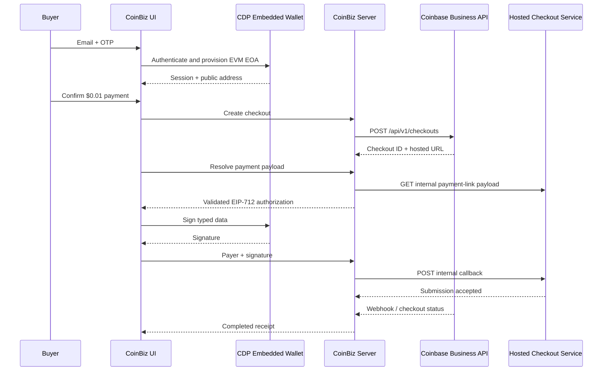

# CoinBiz Embedded Checkout Prototype

**Document type:** Product requirements and technical design
**Status:** Internal demo prototype; not approved as a production integration pattern
**Current network:** Base mainnet
**Current settlement asset:** USDC
**Last updated:** July 21, 2026

## 1. Executive summary

CoinBiz demonstrates a Coinbase Business Checkout completed inside the merchant experience with a Coinbase Embedded Wallet. The buyer signs in by email, receives an embedded self-custodial EVM wallet, funds it, and authorizes a USDC payment without navigating to the Coinbase-hosted checkout page.

The prototype combines two different Coinbase products:

1. **Coinbase Business Checkout APIs** create the merchant checkout, track its lifecycle, settle the payment, and produce the final receipt.
2. **CDP Embedded Wallets** authenticate the buyer and sign the EIP-712 payment authorization in the browser without exposing a private key to CoinBiz.

The no-redirect behavior is not currently a documented Checkout API capability. The prototype resolves and submits the hosted checkout payment through internal `payments.coinbase.com/next-api/payment-links/*` endpoints used by the hosted page. Those endpoints are not a public contract and may change without notice. This is appropriate for an internal demonstration, but it must not be represented as a supported production integration until Coinbase provides or approves a public payment-intent and submission API.

The implementation is **Base-only**. Coinbase's current Checkout API supports USDC on Base. CDP Embedded Wallets support other EVM networks, including Ethereum and Polygon, but wallet network support does not make the Checkout API multichain.

## 2. Product objective

Show developers how a merchant could deliver a native, app-contained stablecoin checkout while retaining Coinbase Business checkout creation, accounting, webhooks, settlement, and refund workflows.

### User promise

> Sign in, fund a wallet, and complete a Coinbase Business Checkout without leaving the product.

### Success criteria

- The buyer never handles a seed phrase or browser extension.
- The merchant's Coinbase Business credentials remain server-side.
- The buyer sees the amount, funding asset, network, and payment state before signing.
- The buyer's private key never becomes available to CoinBiz.
- Coinbase Business remains the system of record for checkout status.
- A completed payment produces the same Checkout API status and receipt data as the hosted flow.

## 3. Important product distinction

“Embedded checkout” in this demo means **a custom payment experience powered by an embedded wallet**. It does not mean CoinBiz is rendering an official Coinbase Checkout React component.

The public Checkout API creates a single-use checkout and returns a Coinbase payment URL. The documented integration hands the buyer to that URL or embeds the hosted experience. CoinBiz instead uses the Checkout API as the merchant ledger, obtains the authorization data behind the hosted link, has the embedded wallet sign it, and submits the result back to the hosted checkout service.

## 4. User flow

### 4.1 Authenticate and provision the wallet

1. The buyer enters an email address.
2. CDP sends a one-time password.
3. The buyer verifies the OTP inside CoinBiz.
4. CDP creates or retrieves an EVM externally owned account (`createOnLogin: "eoa"`).
5. CoinBiz receives the public wallet address and session state from CDP hooks.

The same EVM address can exist across EVM-compatible networks. Assets do not move across networks automatically; the buyer must fund the address on the network used by the checkout.

### 4.2 Fund the wallet

CoinBiz exposes the Base wallet address as text and a QR code. The buyer can send Base USDC or Base ETH from another wallet.

Two funding paths are supported:

- **USDC:** pay directly from the Base USDC balance.
- **ETH:** request a Base ETH-to-USDC quote, execute the swap through CDP, wait for confirmation, then continue with the USDC payment.

The swap is a convenience step. The Coinbase Business Checkout itself is still denominated and paid in USDC.

### 4.3 Create the merchant checkout

CoinBiz's server creates a live checkout through:

`POST https://business.coinbase.com/api/v1/checkouts`

The request is currently fixed to:

- `currency: "USDC"`
- `network: "base"`
- a demo amount of `$0.01`
- optional merchant metadata

CoinBiz stores the returned Checkout ID and hosted payment URL. Coinbase Business API credentials never enter the browser.

### 4.4 Resolve the payment authorization

The CoinBiz server extracts the `pl_*` identifier from the official hosted URL and requests the hosted payment-link payload from:

`GET https://payments.coinbase.com/next-api/payment-links/{paymentLinkId}`

Before exposing a signable payload, the server validates that the hosted response matches the official Checkout API record:

- Base chain ID `8453`
- Base USDC contract
- checkout amount
- checkout receiver
- authorization nonce and expiry

The server then constructs an EIP-712 `ReceiveWithAuthorization` payload for USDC. This is an offchain authorization: the buyer signs permission for the designated collector to transfer the exact USDC amount before the authorization expires.

### 4.5 Sign inside the embedded wallet

CoinBiz passes the validated EIP-712 payload to CDP's `signEvmTypedData` operation. CDP obtains user authorization through the active embedded-wallet session and returns only the signature.

CoinBiz does not receive or store the user's private key. It stores a hash reference to the signature for correlation rather than treating the raw signature as a credential.

### 4.6 Submit without redirect

The browser sends the payer address and signature to the CoinBiz server. The server submits them to:

`POST https://payments.coinbase.com/next-api/payment-links/{paymentLinkId}/callback`

The hosted checkout service verifies the signature and initiates settlement. Because signing and submission happen through APIs, the browser never navigates to `payments.coinbase.com`.

### 4.7 Reconcile and render the receipt

CoinBiz marks the attempt as submitted, then reconciles against:

1. verified Coinbase Business checkout webhooks;
2. `GET /api/v1/checkouts/{checkoutId}` as a polling fallback.

The UI renders `COMPLETED`, `FAILED`, or the in-progress state from Coinbase Business rather than assuming that a successful signature means a successful payment.

## 5. Architecture

## 6. Network support

| Capability | Base | Ethereum | Polygon |
|---|---:|---:|---:|
| CDP embedded EVM wallet | Supported | Supported | Supported |
| EIP-712 signing | Supported | Supported | Supported |
| CDP swaps | Supported | Supported | Supported |
| Coinbase Business Checkout API | **Supported: USDC** | **Not currently supported** | **Not currently supported** |
| CoinBiz embedded checkout prototype | **Implemented** | Not implemented | Not implemented |

### Why changing `network` is insufficient

The current implementation hardcodes Base-specific values in several places:

- chain ID `8453`;
- Base USDC contract `0x833589fCD6eDb6E08f4c7C32D4f71b54bdA02913`;
- Base token-collector contracts;
- Base RPC balance reads and transaction confirmation;
- Base ETH-to-USDC swap routing;
- `network: "base"` on Checkout API creation;
- a Base-only payment-attempt type and validation path.

Ethereum or Polygon would require more than a wallet switch. Coinbase Business must first support Checkout creation and settlement on that network, and the payment authorization must be derived from a supported public API rather than copied from Base constants.

## 7. Functional requirements

### Required for the demo

- Email OTP wallet authentication.
- Automatic EVM EOA provisioning.
- Address copy and mobile QR funding.
- Base USDC balance visibility.
- Optional Base ETH-to-USDC swap.
- Live Checkout API creation with idempotency.
- Exact amount, receiver, token, network, nonce, and expiry validation.
- Explicit buyer action before typed-data signing.
- Asynchronous submission state and final receipt reconciliation.
- Webhook-first completion with polling fallback.
- A maximum checkout amount enforced server-side.
- Clear disclosure that the flow uses live funds.

### Non-goals

- A generic wallet SDK or reusable checkout package.
- Ethereum, Polygon, Solana, or arbitrary-token checkout settlement.
- Server custody of buyer keys.
- Recurring payments or standing spend permissions.
- Silent or background signing.
- Replacing Coinbase Business as the merchant ledger.

## 8. Security and compliance requirements

- Keep Coinbase Business keys and JWT generation server-side.
- Allowlist the exact production origin in CDP Portal.
- Enforce a low per-checkout amount cap for the public demo.
- Rate-limit checkout creation, payload resolution, and submission endpoints.
- Bind each resolved payload to the authenticated browser session and checkout ID.
- Do not accept arbitrary callback URLs, token contracts, collectors, receivers, or typed data from the client.
- Revalidate amount, network, token, receiver, nonce, and expiry immediately before submission.
- Apply CDP signing policies that allow only the expected USDC domain and collector.
- Never log raw signatures, OTP values, wallet secrets, or bearer tokens.
- Use verified Coinbase webhooks for fulfillment; a browser success response is not authoritative.
- Make live-funds and irreversible-payment disclosures visible before signing.

## 9. Prototype risks

### Critical: undocumented hosted endpoints

The resolver and callback under `payments.coinbase.com/next-api` are implementation details of the hosted checkout. Their schemas, authentication, collector addresses, validation, or availability may change without versioning. This is the primary blocker to calling the flow production-ready.

### Critical: hardcoded settlement configuration

The Base USDC and collector addresses are embedded in application code. A hosted-checkout contract migration could break payments or invalidate signatures. A production implementation must receive versioned settlement instructions from an authenticated public API.

### High: public prototype endpoint

The external-signature submission route intentionally permits browser-originated signatures. Before broader exposure, it needs session binding, rate limiting, CSRF/origin controls, replay protection at the application layer, and abuse monitoring in addition to the onchain nonce.

### High: live-only testing

The custom signed-payment path runs against live Base funds. Coinbase's Checkout sandbox is simulated, but this prototype does not have a documented sandbox equivalent for resolving and submitting the authorization.

### Medium: two separate asynchronous systems

Wallet submission and Checkout completion are distinct states. Network delays or webhook failures can leave the UI in `submitted` even when payment later completes. Reconciliation must remain idempotent and resumable.

## 10. Productionization plan

### Phase 0 — Internal demonstration

- Keep the amount capped at `$0.01`.
- Keep Base-only validation.
- Label the experience “Embedded Wallet Checkout — Prototype.”
- Add a visible “Live Base USDC” disclosure.
- Feature-flag the internal resolver and callback.

### Phase 1 — Demo hardening

- Require a signed CoinBiz session for resolution and submission.
- Add per-IP, per-wallet, and per-checkout rate limits.
- Bind a one-time server nonce to the browser session.
- Add structured metrics for create, resolve, sign, submit, webhook, and reconcile stages.
- Add stale-submission recovery and support diagnostics.
- Add automated contract-address drift detection that disables the flow safely.

### Phase 2 — Supported public integration

Proceed only when Coinbase provides or explicitly approves a public API that returns versioned payment instructions and accepts the buyer's signed authorization.

- Replace all `payments.coinbase.com/next-api` calls.
- Remove hardcoded collectors and authorization versions.
- Adopt the public sandbox equivalent.
- Complete security, legal, compliance, and production-readiness reviews.
- Publish a supported integration guide and reference implementation.

### Phase 3 — Multichain

Begin only after Checkout APIs officially support additional networks.

- Introduce a server-owned network configuration registry.
- Derive chain ID, asset contract, decimals, collector, and authorization scheme from authenticated Coinbase instructions.
- Add network-specific balance, swap, explorer, and confirmation providers.
- Test wrong-network funding, chain switching, token approvals, finality, and refund behavior separately for every network.

## 11. Acceptance criteria for a supported release

- No undocumented Coinbase endpoint is called.
- Every payment instruction is authenticated and versioned.
- Sandbox and production use the same public contract.
- The wallet signs only an amount, asset, receiver, network, and expiry shown to the buyer.
- Duplicate requests are idempotent across create, submit, webhook, and reconciliation.
- Checkout completion is confirmed by Coinbase Business, not inferred locally.
- The integration passes wallet, application-security, compliance, and operational reviews.
- Each advertised network has end-to-end tests using its actual USDC contract and settlement path.

## 12. Open questions for the Coinbase team

1. Is there a supported public API for obtaining Checkout payment instructions without loading the hosted URL?
2. Is there a supported public API for submitting an externally signed EIP-3009 authorization?
3. Can the hosted checkout be embedded through an officially supported component or iframe with no top-level redirect?
4. Are the current token-collector addresses and callback payloads contractual or internal-only?
5. Is a sandbox authorization-and-submission flow planned?
6. What is the Checkout API roadmap for Ethereum, Polygon, and other networks?
7. Should merchant applications use EIP-3009, Permit2, smart-account calls, or another scheme for future embedded payments?
8. What additional consent, disclosure, refund, or compliance requirements apply to a merchant-owned embedded experience?

## 13. Implementation map

| Responsibility | Current module |
|---|---|
| Email OTP and wallet provisioning | `components/cdp-embedded-wallet-panel.tsx` |
| Embedded checkout orchestration | `components/coinbase-demo.tsx` |
| Checkout create/get API client | `app/lib/coinbase.ts` |
| Payment resolution, validation, and submission | `app/lib/headless-checkout-payer.ts` |
| Browser/server payment endpoint | `app/api/coinbase/agentic-payments/route.ts` |
| Attempt persistence and reconciliation | `app/lib/agentic-payment-store.ts` |
| Checkout webhook ingestion | `app/api/coinbase/webhooks/[environment]/route.ts` |

## 14. References

- [Coinbase Business Checkout API overview](https://docs.cdp.coinbase.com/coinbase-business/checkout-apis/overview)
- [Checkout API supported assets and networks FAQ](https://docs.cdp.coinbase.com/coinbase-business/checkout-apis/migrate/faq)
- [Create Checkout API reference](https://docs.cdp.coinbase.com/api-reference/business-api/rest-api/checkouts/create-checkout)
- [Checkout webhooks](https://docs.cdp.coinbase.com/coinbase-business/checkout-apis/webhooks)
- [CDP supported networks](https://docs.cdp.coinbase.com/get-started/supported-networks)
- [CDP non-custodial wallets](https://docs.cdp.coinbase.com/wallets/non-custodial-wallets/overview)
- [CDP EIP-712 typed-data signing](https://docs.cdp.coinbase.com/api-reference/v2/rest-api/embedded-wallets/sign-eip-712-typed-data-with-end-user-evm-account)
- [CDP swaps](https://docs.cdp.coinbase.com/wallets/using-wallets/swaps)
